# Dwaar

**Authorization and policy enforcement for AI agents that spend money.**

> Fraud detection asks whether a transaction is bad. We ask whether it was allowed.

```mermaid
flowchart LR
  BA[Buyer agents]:::ext -->|RFC 9421 signed HTTP| GW
  MA[Merchant's own agents]:::ext -->|MCP tool calls| PX[MCP proxy]:::soon
  PX --> GW

  subgraph DWAAR["POST /v1/authorize — 8 stages, p99 target 25ms, zero LLM calls"]
    direction TB
    S1["1 · signature<br/>Ed25519 · fail-closed"]:::soon
    S2["2 · mandate<br/>verify · fail-closed"]:::soon
    S3["3 · features<br/>Redis · degrade"]:::soon
    S4["4 · risk + injection<br/>LightGBM · fail-OPEN"]:::soon
    S5["5 · policy<br/>compiled rules"]:::soon
    S6["6 · budget reserve<br/>ARITHMETIC · fail-closed"]:::done
    S7["7 · decision"]:::soon
    S8["8 · hash + chain + sign"]:::done
    S1 --> S2 --> S3 --> S4 --> S5 --> S6 --> S7 --> S8
  end

  GW[gateway]:::done --> DWAAR
  S7 -->|allow| RZP[Razorpay test mode]:::soon
  S8 --> CH[(decision_records<br/>append-only by GRANT<br/>hash-chained per merchant)]:::done
  CH --> V[independent verifier CLI]:::soon
  GW -. async, off-path .-> EX[LLM explainer]:::soon
  PC[LLM policy compiler<br/>OFFLINE · human-gated]:::soon -->|signed ruleset| S5
  CON[console]:::soon -. SSE .-> GW

  classDef done fill:#1a4d2e,stroke:#2d7a4a,color:#fff
  classDef soon fill:#2b2b2b,stroke:#555,color:#bbb
  classDef ext  fill:#1a3a5c,stroke:#2d6a9f,color:#fff
```



<sub>Green = built (phases 1–2). Grey = scheduled, see `docs/strategy/BUILD_PLAN.md`.</sub>

---

## The problem

Razorpay's MCP Server exposes 35+ money-moving tools to AI agents, authenticated by a
single base64-encoded merchant token. An agent holding that token holds the merchant's
entire commercial authority — no per-principal delegation, no spend bound. Separately,
buyer agents are arriving at merchant checkouts with no way to distinguish a customer from
a card tester.

Both are the same problem: **agents act on delegated authority and nothing verifies the
delegation.**

Dwaar verifies the agent cryptographically, evaluates the mandate its principal signed,
enforces spending with a ledger rather than a model score, and writes a signed,
tamper-evident record of every decision.

## Four rules

1. **No LLM call in the `/v1/authorize` request path.** Ever. Enforced two independent ways
   — see below.
2. **Budget enforcement is arithmetic, never a model score.** `if amount > balance: deny`.
   A 99%-accurate spend cap is a broken spend cap.
3. **`zoo/` must never be importable from `dwaar/`.** Offence and defence separated
   structurally, not by discipline.
4. **No hardcoded metrics.** Every number is computed at run time.

## Quick start

```bash
cp .env.example .env
make up          # postgres + redis + api, migrations applied, from nothing
curl localhost:8080/health
make test        # full suite
```

Without Docker — the database suite is the real gate, so it must be runnable either way:

```bash
brew install postgresql@16 && brew services start postgresql@16
make bootstrap-local   # same two roles, same ownership, as the Compose init script
make test
```

`make verify`, `make eval` and `make demo` exist and **exit 2** — they are not implemented
yet. A stub that exits 0 is a green light for something that does not exist, which is the
same failure mode as a hardcoded metric.

> **`make up` is currently unverified.** Docker is not installed on the development machine
> (`/usr/local/bin/docker` is a dangling symlink to a removed Docker Desktop). The Compose
> stack is written but has never been executed. Everything else below was verified against a
> real PostgreSQL 16.14 via the `bootstrap-local` path. Tracked as **F-010** in
> `FAILURES.md` — including the specific drift risk it leaves between the two role-creation
> scripts.

## Status

Phases 1 and 2 are complete: repository, data model, and the two structural controls.
Everything else is scheduled in `docs/strategy/BUILD_PLAN.md`.

| Built | |
|---|---|
| Package skeleton, Compose, Makefile, CI | ✅ |
| Structured JSON logging, per-request trace IDs, PII allowlist | ✅ |
| `GET /health` | ✅ |
| Schema as migrations, `decision_records` append-only **by GRANT** | ✅ |
| Repository layer, six tables | ✅ |
| Budget ledger — atomic, idempotent, 50-writer clean | ✅ |
| Per-merchant hash chain with explicit `seq` allocation | ✅ |
| Import isolation + hot-path purity + ground-truth isolation tests | ✅ |

| Scheduled | Day |
|---|---|
| 8-stage authorize pipeline | 3 |
| Ed25519, RFC 8785 JCS, RFC 9421, verifier CLI | 4 |
| Policy engine | 5 |
| Risk model, injection detector | 7 |
| Agent zoo (6 archetypes, 2 held out) | 8 |
| Razorpay test mode + MCP proxy | 9 |
| Policy compiler, async explainer | 10 |
| Console, `make demo` | 11 |
| `make eval` + fraud baseline | 12 |

## Three things worth reading the code for

### 1. Append-only is a grant, not a convention — and there is deliberately no trigger

The strategy package specified `REVOKE UPDATE, DELETE ON decision_records FROM PUBLIC`.
**That does nothing.** `PUBLIC` holds no table-level `UPDATE`/`DELETE` by default, and
`REVOKE` never strips the table *owner*. Connect as the owner — the default in every simple
Compose setup — and the table is fully mutable.

What this repo does: `dwaar_app` is **not the owner of anything** and holds
`SELECT, INSERT` on `decision_records`. `dwaar_owner` owns the tables and runs migrations
and the API never connects as it.

And there is no `BEFORE UPDATE` trigger, on purpose. A trigger would block a superuser too —
and a superuser *must* be able to tamper, because the control being demonstrated is
**detection by cryptography, not prevention by DBMS**. The demo tamper runs from a separate
superuser connection, succeeds at the storage layer, and the chain catches it and names the
`seq`. An append-only log that only stops its own application from editing it proves nothing
about an attacker who owns the database.

`tests/db/test_append_only_grant.py` asserts all three: `UPDATE` raises
`InsufficientPrivilege` as `dwaar_app`, `INSERT` still works, and the superuser tamper
still succeeds.

### 2. `seq` is not a `BIGSERIAL`, and the chain is sharded by merchant

`BIGSERIAL` allocates outside transaction control. With `uvicorn --workers 4`, concurrent
inserts commit out of order and rollbacks burn values permanently — while `prev_hash` must
be the `payload_hash` of `seq - 1`. The chain would have been broken by construction on the
first concurrent request.

`seq` is allocated as `max(seq)+1` inside `pg_advisory_xact_lock(hashtext(merchant_id))`.
Keying the lock on merchant shards the chain for the cost of one `hashtext` call, so the
answer to *"does this scale?"* is a fact about the schema rather than a promise.

### 3. The budget ledger's lock target, and the tripwire beside it

`CHECK (balance_after >= 0)` does not prevent overspend. Two transactions can each read the
same tail, each compute a balance from it, and each insert a row that individually passes.
`SELECT ... FOR UPDATE` on the tail does not help either — that locks rows *that exist*, and
the race is two *inserts*. It is a phantom, not a row conflict.

So the mechanism is a mandate-row lock. Beside it sits
`UNIQUE (mandate_id, prev_entry_id)`: under correct locking it can never fire, and if it
ever does, the locking is wrong and the database caught an overspend the CHECK would have
missed.

## Rule 1 is enforced two independent ways

| Test | Claim | Blind spot |
|---|---|---|
| `tests/test_hot_path_purity.py` | The LLM is **not reachable** — static transitive import closure from every request-path module | Cannot see `httpx.post("https://api.anthropic.com/...")`; no import involved |
| `tests/test_no_llm_in_hot_path.py` *(day 10)* | The LLM is **not called** — client monkeypatched to raise, 1,000 authorize requests | Only proves it for the requests sampled |

Neither subsumes the other. Reachability and invocation are different claims.

## Data disclosure

All agent traffic is **synthetic**, generated by `zoo/` making real signed HTTP calls — not
replayed fixtures. Risk-model training data is synthetic and that is the dominant
limitation of the evaluation; it is stated here rather than buried. Cryptography, ledger
arithmetic, decision records and latency measurements are **real**. Razorpay calls are real
**test-mode** calls.

**UAP is a proposal pending RBI approval.** It is modelled and labelled, never claimed as
integrated.

## Layout

```
dwaar/            the service. never imports zoo.
  api/            FastAPI app, middleware, routes
  db/             pool, migration runner, repositories (no ORM)
  money.py        integer paise. no float, anywhere.
  logging.py      structlog JSON, trace IDs, allowlist redaction
migrations/       numbered SQL. 0009 is the append-only control.
tests/            including the three structural tests
zoo/              agent archetypes. localhost only. sibling, never imported.
docs/
  adr/0001-…      the Phase 1-2 decisions. Wins over the strategy package.
  strategy/       the strategy package, read-only reference
THREAT_MODEL.md   written before any decision code
FAIL_MATRIX.md    written before any decision code
FAILURES.md       real-time, never backfilled
```

`docs/strategy/` is vendored reference. This repo's own `THREAT_MODEL.md` and
`FAIL_MATRIX.md` are at the root and govern the code; where they differ from the package,
`docs/adr/0001-phase-1-2-decisions.md` records why.
