# Dwaar

**Authorization and policy enforcement for AI agents that spend money.**

> Fraud detection asks whether a transaction is bad. We ask whether it was allowed.

```mermaid
flowchart LR
  BA[Buyer agents]:::ext -->|RFC 9421 signed HTTP| GW
  MA[Merchant's own agents]:::ext -->|MCP tool calls| PX[MCP proxy]:::done
  PX --> GW

  subgraph DWAAR["POST /v1/authorize — 8 stages, p99 target 25ms, zero LLM calls"]
    direction TB
    S1["1 · signature<br/>RFC 9421 · fail-closed"]:::done
    S2["2 · mandate<br/>verify · fail-closed"]:::done
    G["2.5 · AUTHORITY GATE<br/>pure arithmetic · no I/O"]:::done
    S3["3 · features<br/>Redis windows · degrade"]:::done
    S4["4 · risk<br/>LightGBM + iForest · fail-OPEN"]:::done
    S5["5 · policy<br/>compiled rules"]:::done
    S6["6 · budget reserve<br/>ARITHMETIC · fail-closed"]:::done
    S7["7 · decision<br/>pure function"]:::done
    S8["8 · hash + chain + SIGN"]:::done
    S1 --> S2 --> OB["2.2 · observe<br/>window written BEFORE the gate"]:::done
    OB --> G --> S3 --> S4 --> S5 --> S6 --> S7 --> S8
    G -.->|"cap · category · expiry<br/>short-circuit, risk_score NULL"| S7
  end

  GW[gateway]:::done --> DWAAR
  S7 -->|allow| RZP[Razorpay test mode]:::done
  S8 --> CH[(decision_records<br/>append-only by GRANT<br/>hash-chained per merchant)]:::done
  CH --> V[independent verifier CLI]:::done
  S8 -. outbox, AFTER commit .-> EX[LLM explainer<br/>own DB role · kill it, nothing moves]:::done
  PC[LLM policy compiler<br/>Gemini · OFFLINE · human-gated]:::done -->|signed ruleset| S5
  CON[console]:::done -. SSE .-> GW
  ZOO[agent zoo · 6 archetypes<br/>2 held out until 31 Aug]:::ext -->|real signed HTTP| GW
  CH -->|features| TR[offline trainer<br/>labels never enter dwaar/]:::done
  TR -->|ONNX bundle| S4

  classDef done fill:#1a4d2e,stroke:#2d7a4a,color:#fff
  classDef soon fill:#2b2b2b,stroke:#555,color:#bbb
  classDef ext  fill:#1a3a5c,stroke:#2d6a9f,color:#fff
```



<sub>Everything green is built and running. A healthy request carries an
<strong>empty</strong> <code>degraded_mode</code>; every token that can still appear names a
runtime condition rather than an unbuilt component. The dotted line from the gate to the
decision is the short-circuit that makes <code>risk_score IS NULL</code> structural — on a
per-transaction breach, stages 3 to 6 never run and the record proves it.</sub>

---

## Everything here is measured against synthetic traffic that we wrote

Stated first because it is the dominant limitation and burying it would be the single most
misleading thing this document could do.

All six agent archetypes are ours. Two of them — `compromised` and `sleeper` — were written
in a session with no access to `dwaar/risk/`, no sight of the feature list and no thresholds,
kept on a branch, and run against the model exactly once, on 31 August. That narrows the
problem. **It does not eliminate it, and it is isolation rather than independent authorship:
this was a solo build.**

**The model was wrong about both held-out archetypes, in opposite directions**, and
[`eval/RESULTS.md`](eval/RESULTS.md) leads with that rather than with a recall table.

What is **not** synthetic: the cryptography, the ledger arithmetic, the decision records, the
latency measurements, and the Razorpay calls, which are real test-mode calls.

---

## The problem

Razorpay's MCP Server exposes 35+ money-moving tools to AI agents, authenticated by a
single base64-encoded merchant token. An agent holding that token holds the merchant's
entire commercial authority — no per-principal delegation, no spend bound. Separately,
buyer agents are arriving at merchant checkouts with no way to distinguish a customer from
a card tester.

Both are the same problem: **agents act on delegated authority and nothing verifies the
delegation.**

Dwaar verifies the agent cryptographically, evaluates the mandate its principal signed,
enforces spending with a ledger rather than a model score, and writes a signed,
tamper-evident record of every decision.

## Four rules

1. **No LLM call in the `/v1/authorize` request path.** Ever. Enforced three independent
   ways — see below.
2. **Budget enforcement is arithmetic, never a model score.** `if amount > balance: deny`.
   A 99%-accurate spend cap is a broken spend cap.
3. **`zoo/` must never be importable from `dwaar/`.** Offence and defence separated
   structurally, not by discipline.
4. **No hardcoded metrics.** Every number is computed at run time.

## Quick start

```bash
cp .env.example .env
make up          # postgres + redis + api, migrations applied, from nothing
curl localhost:8080/health
make test        # full suite
```

Without Docker — the database suite is the real gate, so it must be runnable either way:

```bash
brew install postgresql@16 && brew services start postgresql@16
make bootstrap-local   # same two roles, same ownership, as the Compose init script
make test
```

```bash
make demo-seed   # load data/seed/ and drive a chain the console can show
make demo        # beats 1-6 on the timeline's own schedule, expectations asserted
make verify      # the independent verifier — separate process, read-only connection
make eval        # the honest numbers, every one computed at run time
```

**Run demo commands through `make`, never `python -m`.** `.env` carries Docker service
hostnames because that is what the API resolves inside Compose; from the host they do not
resolve at all. Every target exports localhost DSNs, and `?=` means a real environment
variable still wins, so Compose and CI are unaffected.

`verify`, `eval` and `demo` all exited 2 until the thing behind them existed. A stub that
exits 0 is a green light for something that is not there, which is the same failure mode as a
hardcoded metric. All three are now real; `tests/test_absence_controls.py` keeps the
mechanism for the next one.

> **`make up` is still unverified, and that is the largest single gap in this repository.**
> Docker is not installed on the development machine, so the Compose stack has been written
> and never executed. Everything else below was verified against a real PostgreSQL 16 via the
> `bootstrap-local` path — 1,051 tests, the latency gates, the chain verifier and the demo all
> run there. Tracked as **F-010**, including the drift risk it leaves between the two
> role-creation scripts, which are required to agree that `dwaar_app` owns nothing.

## What this project does not claim

Read this before the rest. A reviewer who knows where the floor is reads everything above it
more carefully, not less.

**The behavioural model does not detect compromised agents.** On the two archetypes it had
never seen it scored 18.8% and 92.2%, and the second number is the worse of the two.
**90.2% of `sleeper`'s flags land in the period it is behaving impeccably** — the model is not
catching the defection, it dislikes the agent. On `compromised` the score goes *down* when the
agent defects: 0.366 before, 0.185 after, while the ticket size goes from ₹644 to ₹6,330. The
feature vector has no absolute amount and no measure against an agent's own baseline, so the
thing that defines that archetype is invisible to it.

We predicted this failure mode on 28 August, in `eval/PREDICTIONS.md`, before the agents were
written. That ordering is in the git history and it is the only reason the diagnosis is worth
anything.

**A conventional fraud baseline beats us on one archetype and ties us on another.** Given the
absolute amount — a signal we deliberately do not have — a fitted scorecard reaches 96.1% on
budget breaching against our model's 90.1%, and ties us at 99.4% on card testing. Its fitted
weights come out *negative* on the textbook card-testing signals, which is a fact about our
synthetic traffic rather than about fraud, and **that applies to our model exactly as much.**

**One feature carries 68% of the model's gain, and its meaning is our convention.**
`inter_arrival_variance` is a real signal — an isolated author reasoning only about behaviour
independently produced it. What is ours is the *conclusion* attached to it. Regularity is not
adversarial: a standing order is regular, a cron job is regular. We trained on four archetypes
containing exactly one regular agent and made it a criminal.

**Every accuracy figure here is a measurement of our own generator.** `make eval` prints the
feature importances on every run with a 40% alarm line, because no automated check catches a
feature that correlates with how the generator was written. F-030 and this are two instances
of the same class.

### What the run does support

| | measured |
|---|---|
| a per-transaction breach denied by arithmetic, model never consulted | **495 arithmetic denials, 0 carrying a score** |
| money invariant above the migration-0017 watermark | **0 violations** |
| chain verification over every signed table | **PASS** |
| `injection_flag` distinguishes unchecked from checked-and-clean | **0 disagreements** across 4,369 records |
| no language model reachable from the request path | **0**, enforced three independent ways |
| injection detector, held-out payloads | **10/10 caught, 0/5 benign lookalikes flagged** |

**The model was wrong about two archetypes in two different directions, and not one rupee
moved that a mandate had not authorised — because spending authority was never the model's to
decide.** That separation is the design, and the held-out run is the strongest evidence for it
in the project.

## What to read, and what is in it

| | |
|---|---|
| [`eval/RESULTS.md`](eval/RESULTS.md) | the held-out run: what the model got wrong, why, the fraud-baseline comparison, and every caveat |
| [`eval/PREDICTIONS.md`](eval/PREDICTIONS.md) | five predictions registered **before** the run. Two failed. Committed 28 August — check the timestamp |
| [`eval/LOCKED_INPUTS.md`](eval/LOCKED_INPUTS.md) | bundle hashes, seeds and both worktree SHAs, recorded before the agents ran. The model has not moved since |
| [`zoo/HELD_OUT_SPEC.md`](zoo/HELD_OUT_SPEC.md) | the entire input to the isolated session. Behavioural terms only — no feature names, no thresholds |
| [`DEFENSE.md`](DEFENSE.md) | nine decisions that are not obvious, each with the alternative it rejected and what it costs |
| [`FAILURES.md`](FAILURES.md) | 49 defects, written as they were found and never backfilled. The most useful document here |
| [`FAIL_MATRIX.md`](FAIL_MATRIX.md) | what every component does when it dies, written before any decision code |
| [`THREAT_MODEL.md`](THREAT_MODEL.md) | fifteen threats, also written before any decision code |

## Status

Every phase is complete. `POST /v1/authorize` verifies real RFC 9421 signatures and chains
every decision it renders; the MCP proxy enforces delegated scopes through the same
arithmetic gate; Razorpay test-mode orders are bounded by the ledger reservation; the async
explainer runs in its own process under its own database role; and the held-out evaluation has
been run once and reported.

**Deadline is 2 September.**

| Built | |
|---|---|
| `POST /v1/authorize` — 8 stages + arithmetic gate, per-stage timing | ✅ |
| Signed, hash-chained decision records + chain verification | ✅ |
| Latency gates in CI: pipeline p99 **7.37ms** serial, **20.61ms** under load, vs 25ms | ✅ |
| RFC 9421 inbound verification, key rotation overlap, replay defence | ✅ |
| `make verify` — independent verifier, read-only, no write path | ✅ |
| Idempotency scoped per mandate, namespaced against forgery | ✅ |
| Deterministic policy engine — closed DSL, no `eval`, 0.012ms p99 | ✅ |
| Policy compiler CLI — Gemini, generated tests, human gate | ✅ |
| Console — decision stream, draining budget bars, NULL rendered | ✅ |
| `/health` severity derived from the fail-matrix constant | ✅ |
| Package skeleton, Compose, Makefile, CI | ✅ |
| Structured JSON logging, per-request trace IDs, PII allowlist | ✅ |
| `GET /health` | ✅ |
| Schema as migrations, `decision_records` append-only **by GRANT** | ✅ |
| Repository layer, no ORM, integer paise everywhere | ✅ |
| Budget ledger — atomic, idempotent, 50-writer clean | ✅ |
| Per-merchant hash chain with explicit `seq` allocation | ✅ |
| Import isolation + hot-path purity + ground-truth isolation tests | ✅ |
| Injection detector — structural features, SKU9001 allowed | ✅ |
| `injection_flag` is a tristate: unchecked / clean / flagged | ✅ |
| `make eval` — importances, components separately, false-positive cost | ✅ |
| Behavioural features — Redis windows keyed on (agent, principal) | ✅ |
| Risk model — LightGBM + isolation forest, ONNX, pre-warmed | ✅ |
| Agent zoo — six archetypes, two held out until 31 Aug, localhost only | ✅ |
| Every stage real: `degraded_mode` empty on a healthy request | ✅ |

| Also built | |
|---|---|
| MCP proxy — delegated scopes, unlisted tools denied, same chain | ✅ |
| Razorpay test mode — order amount derived from the ledger reservation | ✅ |
| Async explainer — own process, own DB role, killing it changes no decision | ✅ |
| `make demo` — beats 1–6 on the timeline's schedule, expectations asserted | ✅ |
| Console — chain verifier, MCP enforcement, per-component health | ✅ |
| The money invariant — write path, database trigger, and the verifier | ✅ |
| `dwaar/clock.py` — one time seam, checked by a source scan | ✅ |
| Held-out run — executed once, reported in `eval/RESULTS.md` | ✅ |

Cut deliberately, not "if behind": policy-compiler UI (CLI only), Merkle anchoring (hash
chain only), and — the one that matters — **within-agent baseline features**, which the
held-out run then showed to be the single largest gap in the model. That is written up at the
end of `FAILURES.md` rather than presented as a roadmap.

## Reading the feature importances is a required step

`make eval` prints the top ten on every run, and calls out any single feature above **40% of
total gain**. That number is not a threshold that fails a build — it is a number put in front
of whoever is looking, because the judgment behind it cannot be automated.

The reason is a defect we found and could not have caught automatically. A feature carrying
74% of the model's gain turned out to be a fact about how the *agents were written* rather
than about how agents behave: every adversarial archetype held one cart identifier for its
whole run because that is how each was coded, and the legitimate one rotated because that is
what a shopper does.

There is a leakage gate — Cramér's V per feature against the archetype, and the trainer
refuses to build a model if any single feature crosses it. It did not fire, correctly: the
cart feature passed at 0.625 against a threshold of 0.75.

> **A leakage threshold catches a feature that IS the label. It does not catch a feature that
> correlates with how the generator was written, and no automated check will** — the check
> would have to know which differences between two classes were intended and which were
> incidental, and that is the question the author is answering, not a property of the data.

Treat any feature above 40% as a generator artifact until someone explains why it is not.
`DEFENSE.md` entry 8 has the full account, including the honest conclusion that some almost
certainly remain.

## Four things worth reading the code for

### 1. Append-only is a grant, not a convention — and there is deliberately no trigger

The strategy package specified `REVOKE UPDATE, DELETE ON decision_records FROM PUBLIC`.
**That does nothing.** `PUBLIC` holds no table-level `UPDATE`/`DELETE` by default, and
`REVOKE` never strips the table *owner*. Connect as the owner — the default in every simple
Compose setup — and the table is fully mutable.

What this repo does: `dwaar_app` is **not the owner of anything** and holds
`SELECT, INSERT` on `decision_records`. `dwaar_owner` owns the tables and runs migrations
and the API never connects as it.

And there is no `BEFORE UPDATE` trigger, on purpose. A trigger would block a superuser too —
and a superuser *must* be able to tamper, because the control being demonstrated is
**detection by cryptography, not prevention by DBMS**. The demo tamper runs from a separate
superuser connection, succeeds at the storage layer, and the chain catches it and names the
`seq`. An append-only log that only stops its own application from editing it proves nothing
about an attacker who owns the database.

`tests/db/test_append_only_grant.py` asserts all three: `UPDATE` raises
`InsufficientPrivilege` as `dwaar_app`, `INSERT` still works, and the superuser tamper
still succeeds.

### 2. `seq` is not a `BIGSERIAL`, and the chain is sharded by merchant

`BIGSERIAL` allocates outside transaction control. With `uvicorn --workers 4`, concurrent
inserts commit out of order and rollbacks burn values permanently — while `prev_hash` must
be the `payload_hash` of `seq - 1`. The chain would have been broken by construction on the
first concurrent request.

`seq` is allocated as `max(seq)+1` inside `pg_advisory_xact_lock(hashtext(merchant_id))`.
Keying the lock on merchant shards the chain for the cost of one `hashtext` call, so the
answer to *"does this scale?"* is a fact about the schema rather than a promise.

### 3. The arithmetic gate that makes "the model was never consulted" structural

The pipeline runs risk at stage 4 and budget at stage 6. Left alone, a request breaching
`max_per_txn_paise` would be **scored first** — and the record would carry a non-null
`risk_score`, quietly falsifying the claim the sharpest demo beat rests on. It would not
have shown up until the model landed, because until then the stub returns `None` anyway.

So a pure arithmetic gate runs after the mandate resolves: per-transaction cap, category
allow/deny, expiry — all derivable from the mandate alone, no I/O. A breach short-circuits
stages 3–6 entirely.

The distinction a judge may probe, and the honest answer:

| Denial | Where | `risk_score` |
|---|---|---|
| per-txn cap, category, expiry | the gate, **before** scoring | `NULL` |
| cumulative budget exhaustion | stage 6, **after** scoring | present |

Both are arithmetic. They sit at different points because one needs only the mandate and the
other needs the ledger.

`tests/db/test_authorize_pipeline.py` asserts this three ways — the NULL, the absent ledger
entry, and a spy proving `score_risk` is *never invoked*. The first two could pass vacuously
while stage 4 was a stub returning `None`; the spy could not, and as of 27 August it runs
against a model that genuinely scores. Its first non-vacuous run confirmed the ordering.

A fourth property was added with the model: **the feature layer cannot see a mandate.**
`compute()` has no parameter for one, nothing it imports can reach the database, and a test
holds a request stream fixed while varying the mandate's caps across the gate boundary and
asserts the feature vector does not move. A feature that could restate the cap would let the
model learn to predict the gate — good metrics, meaningless importances, and a claim about
the deterministic/probabilistic split that stops being true.

### 4. The budget ledger's lock target, and the tripwire beside it

`CHECK (balance_after >= 0)` does not prevent overspend. Two transactions can each read the
same tail, each compute a balance from it, and each insert a row that individually passes.
`SELECT ... FOR UPDATE` on the tail does not help either — that locks rows *that exist*, and
the race is two *inserts*. It is a phantom, not a row conflict.

So the mechanism is a mandate-row lock. Beside it sits
`UNIQUE (mandate_id, prev_entry_id)`: under correct locking it can never fire, and if it
ever does, the locking is wrong and the database caught an overspend the CHECK would have
missed.

## Rule 1 is enforced three independent ways

| Test | Claim | Blind spot |
|---|---|---|
| `tests/test_hot_path_purity.py` | The LLM is **not reachable** — static transitive import closure from every request-path module | Cannot see `httpx.post("https://generativelanguage.googleapis.com/...")`; no import involved |
| `tests/test_no_llm_in_hot_path.py` | The LLM is **not called** — client monkeypatched to raise, 1,000 authorize requests across allow, gate-deny and category-deny paths | Only proves it for the requests sampled |
| source scan (same file) | No provider **hostname** appears in request-path source | Blunt; a computed URL evades it |

Reachability, invocation and raw HTTP are three different claims. The provider blocklist is
a single module constant (`tests/_support/llm_blocklist.py`) so adding a provider cannot
update one list and miss the other.

The provider is **Gemini**, chosen for native JSON-schema-constrained output, which the
policy compiler needs. `dwaar/llm/client.py` is provider-agnostic; nothing else knows.
`openai` is on the blocklist regardless, because NVIDIA's endpoint speaks the
OpenAI-compatible protocol through the same SDK.

## What the latency numbers mean

| Number | Measured | Where |
|---|---|---|
| pipeline p99 **< 25ms** — currently **2.11ms** | in-process, **excluding HTTP framing and network**, including the chain write | CI gate |
| HTTP p99 < 150ms — currently 4.70ms | full request through the ASGI stack, same host | CI guard rail, deliberately loose |
| `decision_records.latency_us` | request start → just before the INSERT | every record |

Quoting the pipeline figure requires the clause *"in-process pipeline, excluding HTTP
framing and network"* attached, every time. `latency_us` cannot include its own write — it
is a column in the row being written, and patching it afterwards would need an UPDATE grant
on an append-only table. `dwaar_authorize_duration_seconds` on `/metrics` carries the
complete figure.

Both are same-host numbers with a local database. They are not a claim about production.

## Data disclosure

Stated at the top of this document as well, because it is the dominant limitation. All agent
traffic is **synthetic**, generated by `zoo/` making real signed HTTP calls — not replayed
fixtures. Cryptography, ledger arithmetic, decision records and latency measurements are
**real**. Razorpay calls are real **test-mode** calls, and the console renders a SIMULATED
badge from `/health` whenever an integration is stubbed, so nobody can describe a stub as a
live integration by accident.

**UAP is a proposal pending RBI approval.** It is modelled and labelled, never claimed as
integrated.

## Layout

```
dwaar/              the service. never imports zoo.
  api/              FastAPI app, middleware, routes
  authorize/        the pipeline: eight stages plus the arithmetic gate
  crypto/           RFC 9421, JCS, Ed25519, the signed-blob/column registry
  db/               pool, migration runner, repositories (no ORM)
  mcp/              scope map + proxy. one authorization path, not a second one.
  policy/           closed-operator DSL, compiler, engine, baseline bands
  risk/             features, observations, model, injection detector
  explain/          the async explainer. blocklisted from every request path.
  outbox.py         publishes a record id after commit. NOT in explain/ — see DEFENSE 6.
  invariants.py     the money invariant. one rule, three enforcement points.
  clock.py          the only wall clock. checked by tests/test_clock_seam.py.
  money.py          integer paise. no float, anywhere.
migrations/         numbered SQL. 0009 is the append-only control; 0017 is the money invariant.
tests/              1,051 of them, including six structural checks
zoo/                six agent archetypes. localhost only. sibling, never imported.
tools/gen_seed.py   deterministic fixture + keypair generator
tools/demo.py       drives the timeline and asserts every expectation
tools/lock_inputs.py  what a held-out run is a test OF
eval/               report, fraud baseline, predictions, locked inputs, results
data/seed/          generator output. regenerate, never hand-edit.
console/            React. five screens. reads the chain, never a parallel view.
```

`THREAT_MODEL.md`, `FAIL_MATRIX.md`, `FAILURES.md` and `docs/adr/` are this repo's own
engineering artifacts and govern the code. Several of them cite a planning package by path
(`docs/strategy/…`) as the source of a decision. **That directory is intentionally not in
this repository** — it holds pitch and evaluation-strategy material that has no business in
public history. The citations are provenance, not dependencies: nothing in the build, the
tests, or the runtime reads that path.
